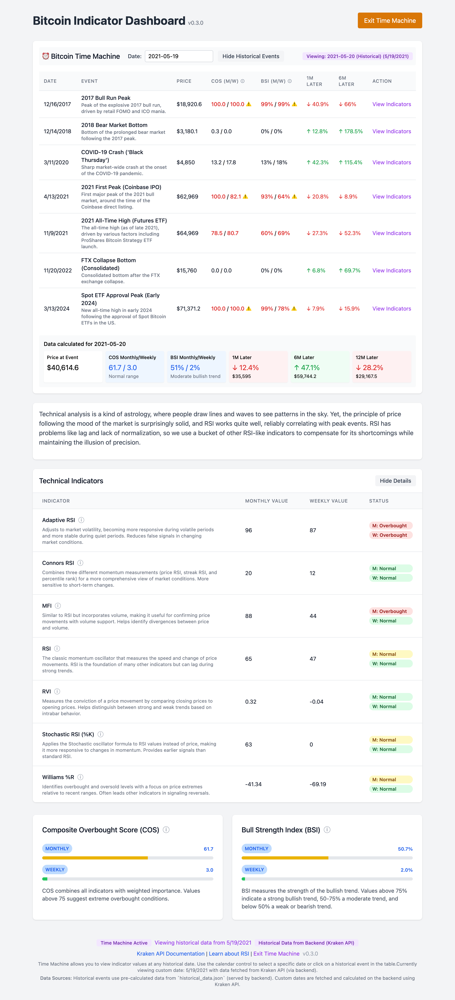

# Bitcoin Indicator Dashboard (v0.2.0)

A web application that displays various technical indicators for Bitcoin to help identify potential sell signals. The application calculates technical indicators and displays them in a user-friendly dashboard.



*Screenshot of the Bitcoin Indicator Dashboard showing technical indicators and composite metrics*

## Project Origin

This project is vibecoded:
- Original PRD created by Grok 3
- Implementation by Augment using Sonnet 3.7

The project demonstrates how AI can be used to create functional applications with minimal human intervention.

## Features

- Displays key technical indicators for Bitcoin:
  - Relative Strength Index (RSI)
  - Stochastic RSI
  - Money Flow Index (MFI)
  - Connors RSI
  - Williams %R
  - Relative Vigor Index (RVI)
  - Adaptive RSI
- Shows both monthly and weekly values for all indicators
- Provides composite metrics:
  - Composite Overbought Score (COS)
  - Bull Strength Index (BSI) - originally TSI, Trend Strength Index
- Enhanced Time Machine feature:
  - View indicators at any historical date using calendar control
  - Shows what happened 1, 6, and 12 months after each point
  - Includes 12 significant Bitcoin market events from 2011 to 2024
  - Displays price changes and percentage movements
  - Interpolates prices for custom dates
- Foldable indicator table with detailed descriptions
- Technical analysis explanation with sarcastic tone
- Stores historical data in SQLite database
- Automatically refreshes data every 5 minutes
- Fallback to mock data when backend is unavailable
- Clear visual indicator showing data source (Live Kraken Data, Mock Data, or Time Machine)

## Architecture

The application consists of two main components:

1. **Backend (Python/Flask)**
   - Serves pre-calculated indicator data from SQLite database
   - Provides API endpoints for the frontend
   - Note: While the application includes code for fetching data from Kraken API, the current implementation primarily relies on pre-calculated historical data stored in `historical_data.json`

2. **Frontend (HTML/JavaScript/React)**
   - Displays the dashboard UI with a clean, modern interface
   - Fetches data from the backend API
   - Visualizes indicators and metrics
   - Implements the Time Machine feature with calendar control
   - Calculates price interpolations for custom dates
   - Provides detailed descriptions for each indicator

## Setup and Installation

### Prerequisites

- Docker and Docker Compose (recommended for the most reliable setup)
- Python 3.7+ (Python 3.12 recommended) if not using Docker
- Make (optional, for using the Makefile)
- Node.js (optional, for development)

### Option 1: Using Docker (Recommended)

This option uses Docker to run both the backend and frontend in containers. Docker is the recommended approach because:

- It eliminates dependency and environment issues across different operating systems
- Ensures consistent behavior regardless of your local Python setup
- Avoids port conflicts with system services (like AirPlay on macOS)
- No need to install Python packages or worry about version compatibility

```bash
# Make the script executable
chmod +x docker-start.sh

# Start the application
./docker-start.sh
```

The script will:
1. Check if Docker and Docker Compose are installed
2. Build and start the containers
3. Provide URLs to access the application

Then access the application at http://localhost:8000

To view logs:
```bash
docker-compose logs -f
```

To stop the application:
```bash
docker-compose down
```

### Option 2: Using Make

The project includes a Makefile that simplifies installation and running the application:

```bash
# Install dependencies
make install

# Run both backend and frontend servers
make run

# Run only the frontend server (with mock data)
make run-frontend

# Run only the backend server
make run-backend

# Show all available commands
make help
```

Then access the application at http://localhost:8000. If the backend is working correctly, you'll see "Live Kraken Data" in the footer, otherwise, it will show "Mock Data".

### Option 2: Using Shell Scripts

#### Frontend Only with Mock Data (Simplest)

This option runs only the frontend with mock data, requiring no backend setup:

```bash
./start_frontend.sh
```

Then access the application at http://localhost:8000. The application will display mock data with an indicator showing "Mock Data" in the footer.

#### Full Application with Backend

This option runs both the backend and frontend servers:

```bash
./fix_and_run.sh
```

The script will:
1. Install all required dependencies in your current Python environment
2. Start a simple Flask backend server on port 5001 (avoiding conflicts with AirPlay on macOS)
3. Start the frontend server on port 8000

Then access the application at http://localhost:8000. If the backend is working correctly, you'll see "Live Kraken Data" in the footer.


### Option 4: Manual Setup (Not Recommended)

**Note:** The manual setup instructions are provided for completeness but are not thoroughly tested across all environments. Docker is strongly recommended for the most reliable experience.

#### 1. Install the required Python packages:

If you're using Conda:
```bash
conda install flask requests numpy pandas
pip install flask-cors
```

If you're using system Python:
```bash
pip install flask flask-cors requests numpy pandas
```

**Note for Python 3.12 users:** Make sure to install numpy version 1.26.0 or higher:
```bash
pip install "numpy>=1.26.0"
```

#### 2. Start the backend server:
```bash
python simple_server.py
```

The server will run on http://localhost:5001

#### 3. In a separate terminal, start the frontend server:
```bash
python -m http.server 8000
```

Then access the application at http://localhost:8000

## API Endpoints

- `GET /api/indicators` - Get the latest calculated indicators
- `POST /api/refresh` - Manually trigger a data refresh

## Data Storage

The application uses SQLite for data storage with the following tables:

- `monthly_ohlc` - Monthly OHLC data
- `weekly_ohlc` - Weekly OHLC data
- `indicators` - Calculated indicators

## Troubleshooting

### "No module named 'numpy'" or Other Package Errors

If you encounter dependency errors and are not using Docker, try the following solutions:

1. **For Conda environments**:
   ```bash
   conda install numpy pandas flask requests
   pip install flask-cors
   ```

2. **For system Python**:
   ```bash
   pip install wheel
   pip install "numpy>=1.26.0"  # For Python 3.12 compatibility
   pip install pandas
   pip install flask
   pip install flask-cors
   pip install requests
   ```

3. **Python Version Compatibility**:
   - The application has been updated to work with Python 3.12, which requires numpy 1.26.0+
   - If you're using an older Python version (3.7-3.11), you may use older numpy versions
   - To avoid dependency issues altogether, use the Docker setup

### "Address already in use" Error on Port 5000 (macOS)

On macOS, port 5000 is often used by the AirPlay Receiver service, which can cause conflicts when trying to run the Flask server.

1. **Solution 1**: Use Docker (recommended)
   - The Docker setup automatically handles port mapping and avoids conflicts

2. **Solution 2**: Use the updated scripts
   - The `fix_and_run.sh` script and `simple_server.py` have been updated to use port 5001 instead of 5000

3. **Solution 3**: Disable AirPlay Receiver
   - Go to System Preferences → General → AirDrop & Handoff
   - Disable the 'AirPlay Receiver' service

4. **Solution 4**: Manually specify a different port
   - When running the Flask server manually, specify a different port:
   ```bash
   python app.py --port 5001
   ```

### "Mock Data" Indicator

If you see "Mock Data" in the footer of the application, it means:
1. The backend server is not running, or
2. The backend server is not accessible from the frontend

To fix this:
1. Make sure the backend server is running on port 5001
2. Check for any network or firewall issues
3. Run the full application with `./fix_and_run.sh`

Note: The application is designed to work with pre-calculated historical data stored in `historical_data.json`. While it includes code for fetching data from the Kraken API, the current implementation primarily uses this historical data and mock data for demonstration purposes. The "Live Kraken Data" indicator in the footer simply means the backend is successfully serving data, not necessarily that it's fetching real-time data from Kraken.

### System-specific issues

- **Windows**: Make sure you have the Microsoft Visual C++ Build Tools installed
- **macOS**: You might need to install Xcode Command Line Tools
- **Linux**: You might need to install python3-dev package

## Using the Makefile

The project includes a Makefile that simplifies common tasks. Here are the available commands:

```bash
# Show help and available commands
make help

# Install dependencies
make install

# Run both backend and frontend servers
make run

# Run only the frontend server (with mock data)
make run-frontend

# Run only the backend server
make run-backend

# Clean up temporary files and database
make clean

# Run tests to check if the backend is working
make test
```

You can also customize the behavior using environment variables:

```bash
# Use a specific Python interpreter
PYTHON=python3.9 make run

# Use different ports
BACKEND_PORT=5002 FRONTEND_PORT=8080 make run
```

## Future Improvements

- Add more technical indicators
- Implement user authentication
- Add historical charts for each indicator
- Create alert system for overbought conditions
- Improve error handling and retry logic
- Add unit tests
- Add support for more cryptocurrencies
- Implement a more robust backend with scheduled data collection
- Add export functionality for indicator data
- Create mobile-responsive design for better mobile experience
- Implement WebSockets for real-time updates

## License

MIT
